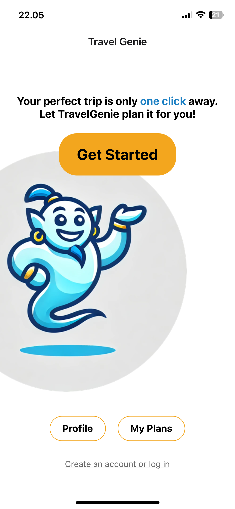

<!-- Improved compatibility of back to top link: See: https://github.com/othneildrew/Best-README-Template/pull/73 -->
<a name="readme-top"></a>

<!-- PROJECT LOGO -->
<br />
<div align="center">
  <a href="https://github.com/joaovitortc/TravelGenie">
    
  </a>

  <h1 align="center">Travel Genie</h1>

  <p align="center">
    Your personalized travel planner powered by AI
    <br />
  </p>
</div>

<br />

<!-- TABLE OF CONTENTS -->
<details>
  <summary>Table of Contents</summary>
  <ol>
    <li>
      <a href="#about-the-project">About The Project</a>
      <ul>
        <li><a href="#built-with">Built With</a></li>
      </ul>
    </li>
    <li><a href="#file-structure">File Structure</a></li>
    <li><a href="#usage">Usage</a></li>
    <li><a href="#contact">Contact</a></li>
    <li><a href="#acknowledgments">Acknowledgments</a></li>
  </ol>
</details>

  <!-- ABOUT THE PROJECT -->
## About The Project
<div>
  

  <p align="center"> TravelGenie is a revolutionary mobile app focused on simplifying travel planning. Utilizing artificial intelligence, TravelGenie generates personalized travel plans tailored to each user's interests and current location.<p/>
    <br/> 
    Users can:
    <li>Create new travel plans</li>
    <li>Regenerate a new plan based on a previous plan</li>
    <li>Save and revisit their plans</li>
    <li>Log in, sign-up and edit profile</li>
    <br/>
    <p align="center">Whether you're exploring new destinations or revisiting familiar ones, TravelGenie enhances your travel experience by providing intuitive, customizable travel plans at your fingertips.</p>
  

  ### Built With

 
 
 
 

  <p align="right">(<a href="#readme-top">back to top</a>)</p>
</div>
<br/><br/><br/><br/><br/><br/>

## File Structure

```bash
TravelGenie/
│
├── assets/
│   ├── fonts/         
│   ├── images/       
│   └── screenshots/      
│
├── app/
│   ├── (tabs)/                #  Where index.jsx can be found, home screen of the application  
│   └── journey/               #  All the User Journey screens and logic when user press "Get Started"
│   └── plans/                 #  My Plans and Plan Detail screens
│   └── profile/               #  Login/Signup and Profile screens
│   └── firebase.js            #  Responsible for firebase config
│   └── openai.js              #  Responsible for openai API config
│   └── ...
│
├── components/                #  Several components can be found, main ones:
│   ├── Loading.jsx            
│   └── PlanCard.jsx
│   └── NoPlansScreen.jsx
│   └── ...      
│
├── constants/                 #  For colors used several times
│
├── .gitignore                 #  Git ignore file
├── README.md                  #  Project README file
└── app.json                   #  Configuring Expo
└── ...
```

<!-- USAGE EXAMPLES -->
## Usage


<p align="right">(<a href="#readme-top">back to top</a>)</p>

</br>

<!-- LICENSE -->
## License

Distributed under the MIT License. See `LICENSE.txt` for more information.

</br>

<!-- ACKNOWLEDGMENTS -->
## Acknowledgments

coantributors

<p align="right">(<a href="#readme-top">back to top</a>)</p>
</br>
</br>

